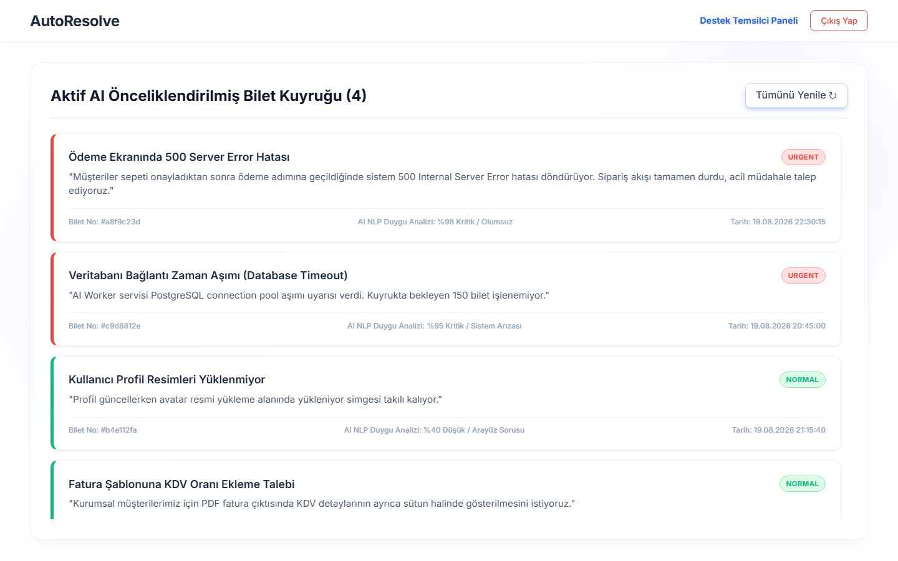
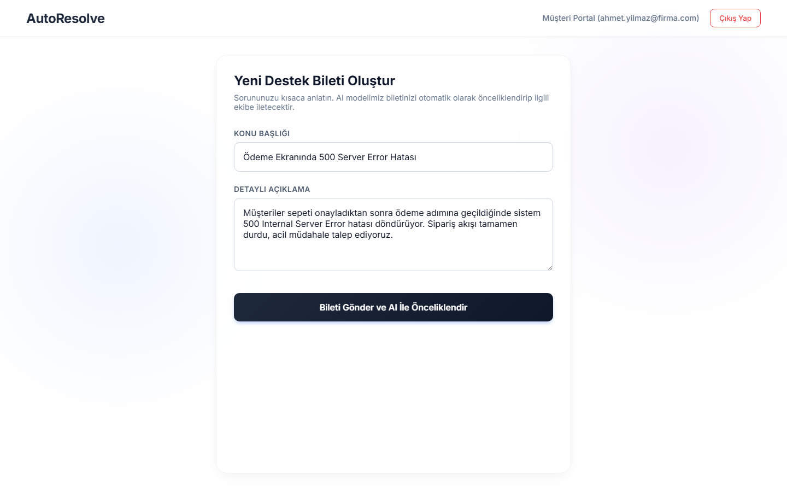
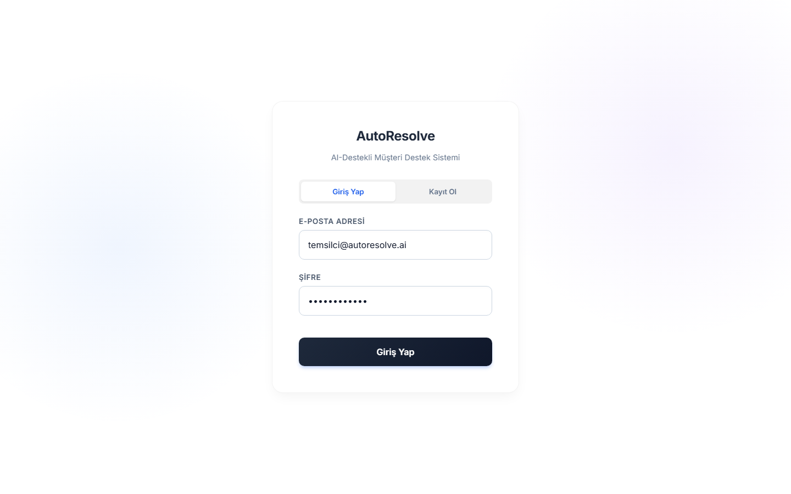
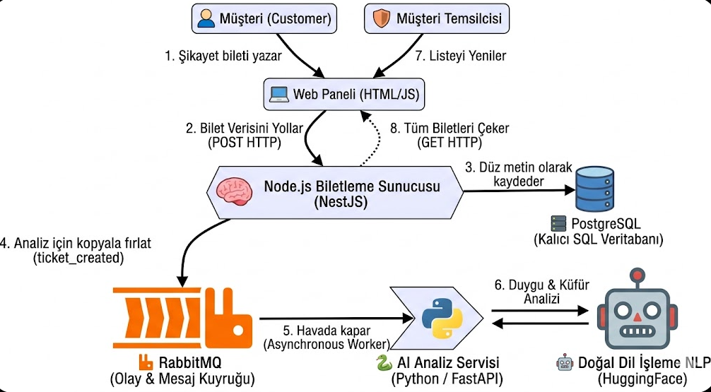

# AutoResolve - AI-Destekli Akıllı Müşteri Destek ve Biletleme Sistemi

A distributed support ticketing system built with Node.js, Python, PostgreSQL, and RabbitMQ. Features an asynchronous NLP pipeline to auto-categorize incoming tickets using HuggingFace.

---

## 🎨 Ekran Görüntüleri (UI Screenshots)

### 1. Destek Temsilcisi Paneli (AI NLP Duygu Analizi & Bilet Önceliklendirme Kuyruğu)


### 2. Müşteri Portalı (Yeni Bilet Oluşturma)


### 3. Kullanıcı Giriş & Kayıt Ekranı


---

## 🏗️ Sistem Mimarisi & Dokümantasyon

Detaylı teknik mimari tasarımı ve ölçeklenebilirlik kararları için [Sistem Mimarisi Dokümanı](docs/architecture_design.md) dosyasını inceleyebilirsiniz.



---

## 📂 Proje Yapısı (Project Structure)

```text
AutoResolve/
├── ai-service/             # Python (FastAPI) AI Worker & NLP Duygu Analizi Servisi
│   ├── main.py
│   ├── nlp_model.py
│   ├── worker.py
│   └── requirements.txt
├── core-api/               # Node.js (NestJS) Core REST API Servisi
│   ├── src/
│   ├── package.json
│   └── tsconfig.json
├── docs/                   # Dokümantasyon ve Görseller
│   ├── architecture_design.md
│   └── images/
│       ├── admin_dashboard.png
│       ├── customer_dashboard.png
│       ├── login_page.png
│       └── system_architecture.png
├── web-ui/                 # Client Web UI (Modern SPA Arayüzü)
│   ├── index.html
│   ├── admin.html
│   ├── customer.html
│   ├── preview_admin.html
│   └── style.css
├── docker-compose.yml      # PostgreSQL, Redis & RabbitMQ Konfigürasyonu
├── .gitignore              # Proje Geneli Git İhmal Kuralları
└── README.md               # Proje Açıklaması ve Kurulum Rehberi
```

---

## ✨ Özellikler (Features)
- **NestJS Core API**: CRUD operasyonları, yetkilendirme (JWT) ve iş lojiği yönetimi.
- **FastAPI AI Worker**: RabbitMQ kuyruğundaki biletleri asenkron tüketerek HuggingFace NLP modeliyle duygu analizi ve kategorizasyon yapar.
- **Vanilla JS Client**: Event-driven mimariyi ve canlı durum güncellemelerini gösteren hafif modern SPA arayüzü.

---

## 🚀 Kurulum (Installation)

### 1. Altyapı (Infrastructure)
PostgreSQL, Redis ve RabbitMQ servislerini başlatın:
```bash
docker-compose up -d
```

### 2. Core API (Node.js)
```bash
cd core-api
npm install
npm run start:dev
```
`http://localhost:3000` adresinde çalışır.

### 3. AI Worker (Python)
```bash
cd ai-service
python -m venv .venv
.venv\Scripts\activate
pip install -r requirements.txt
python main.py
```

### 4. Kullanıcı Arayüzü (Web UI)
Tarayıcınızda `web-ui/index.html` dosyasını açın.


